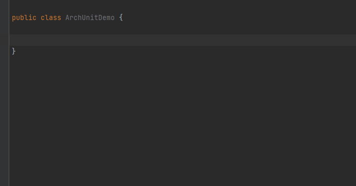
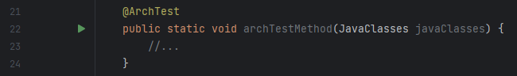

# JUnit Support

## JUnit5 `@Disabled` annotation has no effect on `@ArchTest` annotated test methods


According to the [Ignoring Tests](https://www.archunit.org/userguide/html/000_Index.html#_ignoring_tests) section of the official ArchUnit documentation
> the annotation <code>@Disabled</code> has no effect here. Instead, <code>@ArchIgnore</code> should be used.

This inspection reports `@ArchTest` annotated test methods annotated with `@Disabled`. If the method is not already annotated
with `@ArchIgnore` as well, it also provides a quick fix to replace the `@Disabled` annotation with `@ArchIgnore`.

```java
//From:
@Disabled
@ArchTest
static void testMethod() { }

//To:
@ArchIgnore
@ArchTest
static void testMethod() { }
```

## Generate `@ArchTest` annotated fields and methods


The Alt+Insert (or similar) **Generate** menu is added two actions:
- **@ArchTest Field**: generates an `@ArchTest` annotated field based on the code template called *ArchTest Field*
- **@ArchTest Method**: generates an `@ArchTest` annotated method based on the code template called *ArchTest Method*

Both options generate the fields/methods after the closest preceding method or field to the caret position,
or if there is no preceding method or field, then right at the beginning of the class.

The method/field name template variables are configured to suggest possible method/field names,
while the field rule initializer is configured to invoke code completion for quicker coding.



## Run individual `@ArchTest` methods


This plugin registers two new test frameworks into the IntelliJ Platform: the JUnit4 and JUnit5 variants of ArchUnit.

This results in the following features added to ArchUnit specific JUnit test classes:
- 'Run' gutter icons appear in front of `@ArchTest` annotated methods, so that individual test methods can be executed.
  - These gutter icons have the same functionality as when they appear in front of regular JUnit test methods.
- The insertion of test, before and after methods via the Alt+Insert **Generate** menu is still possible via dedicated code templates.
  - The test method's template is specific to ArchUnit.



**NOTES:**
- When invoking one of the run/debug options on a **JUnit4** ArchTest method, **all test methods/fields** in that class are executed.
  - This is the behaviour also when running the test via Gradle CLI.
  - It appears that, intentionally or not, test filtering is not applied via `gradle test --test ...`. 
- The execution of `@ArchTest` annotated `ArchRule` fields is not supported.
- In case of JUnit4, `@ArchTest` annotated methods, by default without this plugin, are recognized as test methods by IntelliJ, when the test class is annotated with
`@RunWith`, but the class itself is still not recognized as an ArchUnit test class.
